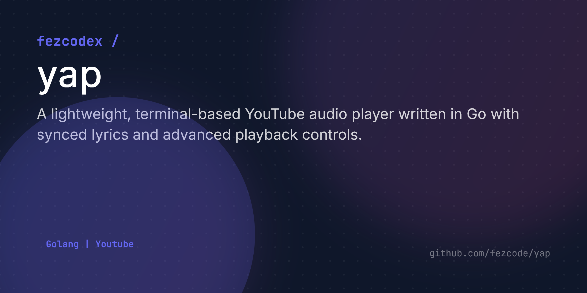

# YAP - YouTube Audio Player (CLI)

A lightweight, terminal-based YouTube audio player written in Go. It streams audio directly from YouTube URLs and supports playback queuing, synced lyrics, and advanced playback controls.



## Prerequisites

- **Go**: Version 1.18 or higher.
- **FFmpeg**: Required for decoding YouTube's audio streams (Opus/AAC) into PCM format for playback. 
  - Ensure `ffmpeg` is in your system's `PATH`.

## Libraries & Dependencies

This project leverages several high-quality Go libraries:

| Library | Purpose |
| :--- | :--- |
| `github.com/kkdai/youtube/v2` | Handles YouTube video metadata fetching and stream URL extraction. |
| `github.com/charmbracelet/bubbletea` | The TUI (Terminal User Interface) framework used for handling the application's lifecycle and events. |
| `github.com/charmbracelet/bubbles` | Provides the progress bar component. |
| `github.com/charmbracelet/lipgloss` | Used for styling and layout of the terminal UI. |
| `github.com/gopxl/beep` | A powerful audio library used for PCM playback and speaker management. |
| `github.com/fezcode/go-piml` | Used for parsing `.piml` playlist files (v1.1.2). |

Lyrics are fetched from the excellent [LRCLib](https://lrclib.net/) API.

## Project Structure

```text
yap/
├── src/               # Go source code
│   ├── audio.go       # Audio streaming and processing
│   ├── lyrics.go      # Lyric fetching and parsing
│   ├── main.go        # Entry point and initialization
│   ├── playlist.go    # Playlist loading logic
│   ├── types.go       # Shared data structures
│   └── ui.go          # TUI model and rendering
├── playlist.piml      # Example PIML playlist
└── playlist.txt       # Example text playlist
```

## Building the Project

To build the executable, run:

```bash
go build -o yap.exe ./src
```

## Usage

Provide one or more YouTube URLs as arguments or use a playlist file:

```bash
# Direct URLs
./yap.exe <url1> [url2] ...

# From a playlist file
./yap.exe --file playlist.txt
./yap.exe --file playlist.piml
```

## Playlist Formats

The player supports two types of playlist files via the `--file` flag:

### 1. Plain Text (`.txt`)
A simple list of YouTube URLs, one per line. Lines starting with `#` are ignored.

**Example (`playlist.txt`):**
```text
https://www.youtube.com/watch?v=d8_YZ7QVQlQ
https://www.youtube.com/watch?v=VpKiN_mMB1g
# This is a comment
https://www.youtube.com/watch?v=27lPAUdE1ys
```

### 2. PIML (`.piml`)
A structured format using the PIML language. This allows you to define custom names for tracks which will be displayed in the **Playlist View (`V`)**.

**Example (`playlist.piml`):**
```piml
(videos)
  > (video)
    (name) Tears by Health
    (url) https://www.youtube.com/watch?v=d8_YZ7QVQlQ

  > (video)
    (name) Even Though - Morcheeba
    (url) https://www.youtube.com/watch?v=VpKiN_mMB1g
```

## Controls

- **Space**: Pause / Resume playback.
- **+ / -**: Adjust volume.
- **M**: Mute / Unmute.
- **L**: Toggle Synced Lyrics (A/D to scroll non-synced lyrics).
- **V**: Toggle Playlist view.
  - **Up / Down Arrow**: Select track in playlist view.
  - **Enter**: Play selected track.
- **R**: Randomize (Shuffle) the current list.
- **N**: Skip to the next track in the queue.
- **P**: Previous track (restarts current track if it has played for > 3 seconds).
- **Left / Right Arrow**: Seek backward/forward 10 seconds.
- **Q / Ctrl+C**: Quit the player.

*Note: The player will automatically loop back to the first song after the last track finishes.*